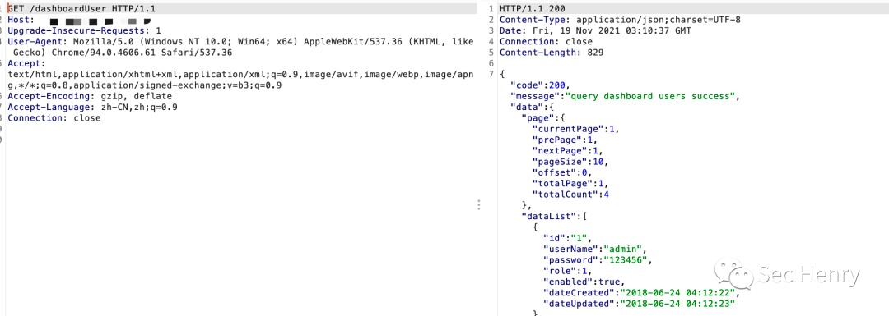

### 一 漏洞描述
Apache ShenYu（原名 Soul）是一个异步的、跨语言的、多协议的高性能响应式API 网关，并可应用于所有微服务场景。
2021 年 11 月 16日，Apache发布安全公告，公开了Apache ShenYu中的一个身份验证绕过漏洞（CVE-2021-37580），该漏洞的CVSS评分为9.8。由于ShenyuAdminBootstrap中JWT的错误使用，导致攻击者可以绕过身份验证，直接进入目标系统后台。

### 二 漏洞利用
`/dashboardUser`

### 三 漏洞修复
升级到Apache ShenYu 2.4.1版本

> 参考链接  
> http://www.360doc.com/content/12/0121/07/67871819_1005069394.shtml
