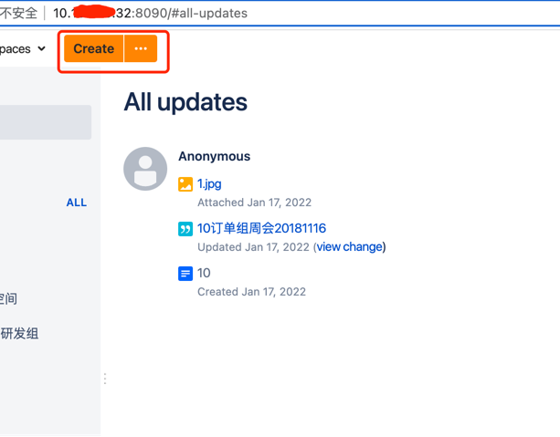
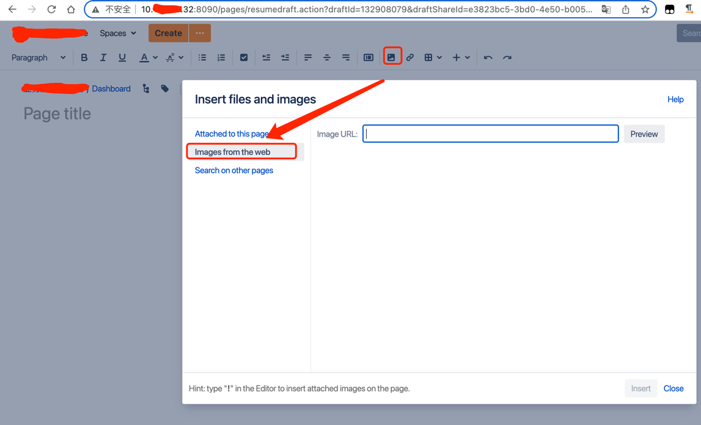
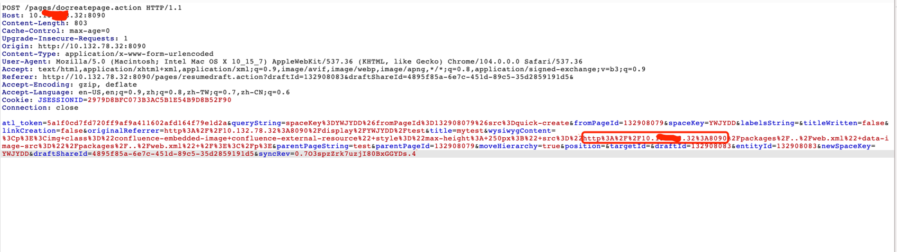
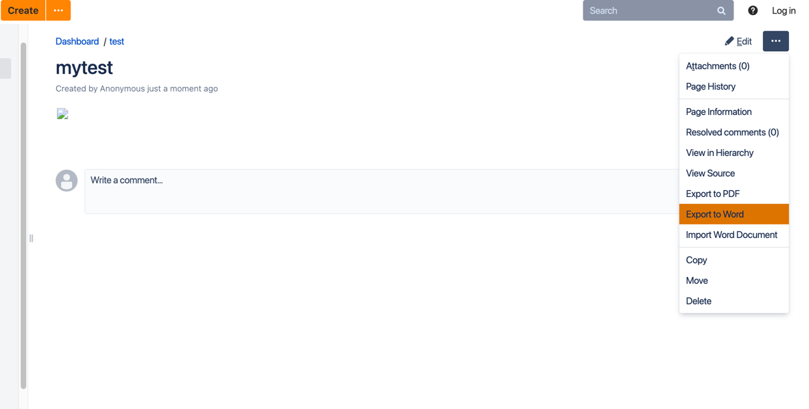
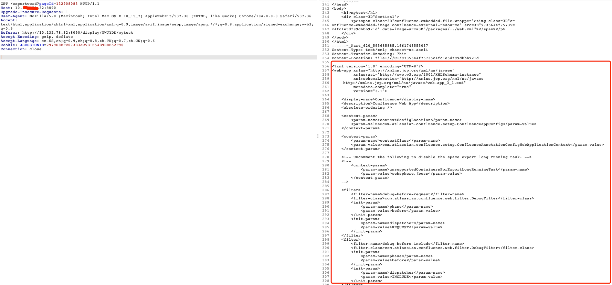

### 一 漏洞描述
Confluence 本地文件泄露漏洞（CVE-2019-3394）

该漏洞存在于Confluence Server和Data Center的页面导出至Word文档功能中。具有创建页面（Add Page）权限的攻击者，可利用该漏洞读取Confluence服务器中<安装目录>/confluence/WEB-INF/目录下包含的任意文件。根据服务器中实际存储的文件内容，该漏洞可能导致泄露以下信息：

.jsp文件源代码
./classes目录
LDAP认证凭据（位于atlassian-user.xml中）
其他可能存在的敏感信息

### 二 漏洞利用
创建空间  

点击上传  

在发布的时候修改掉图片链接，把远程地址 `http://ip:端口` 去掉   

在发布的页面导出word，查看改返回包  

### 三 漏洞修复
1 升级版本  
6.1.0 <= 版本号 <6.6.16  
6.7.0 <= 版本号 <6.13.7  
6.14.0 <= 版本号 <6.15.8  

2 添加访问控制

> 参考链接  
> http://blog.nsfocus.net/cve-2019-3394/
