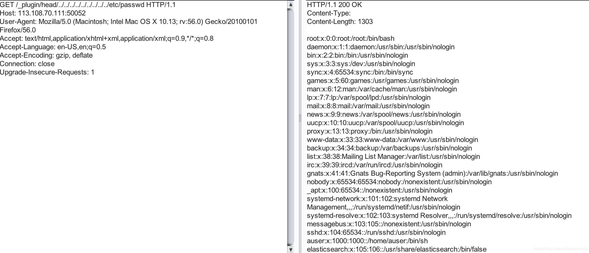

### 一 漏洞描述
ElasticSearch目录遍历漏洞(CVE-2015-3337)  
此漏洞存在于elasticsearch的备份功能中,elasticsearch 1.5.1及以前，无需任何配置即可触发该漏洞。之后的新版，配置文件elasticsearch.yml中必须存在path.repo，该配置值为一个目录，且该目录必须可写，等于限制了备份仓库的根位置。不配置该值，默认不启动这个功能。

### 二 漏洞利用

### 三 漏洞修复
升级elasticsearch等级到1.6.1及以上

> 参考链接
> https://blog.csdn.net/sycamorelg/article/details/117740853
