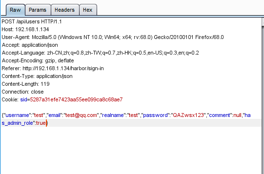

### 一 漏洞描述
Harbor是一个用于存储和分发Docker镜像的企业级Registry服务器，通过添加一些企业必需的功能特性，例如安全、标识和管理等，扩展了开源Docker Distribution。
作为一个企业级私有Registry服务器，Harbor提供了更好的性能和安全。提升用户使用Registry构建和运行环境传输镜像的效率。

该漏洞是一个垂直越权漏洞，因注册模块对参数校验不严格，可导致任意管理员注册。攻击者注册管理员账号后可以接管Harbor镜像仓库，从而写入恶意镜像，最终可以感染使用此仓库的客户端等。

### 二 漏洞利用
注册时添加参数 `"has_admin_role":true`

### 三 漏洞修复
升级Harbor版本到 1.7.6 和 1.8.3

> 利用链接
> https://cloud.tencent.com/developer/article/1553934
