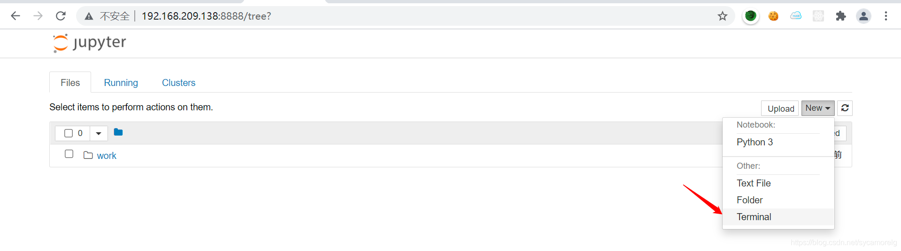
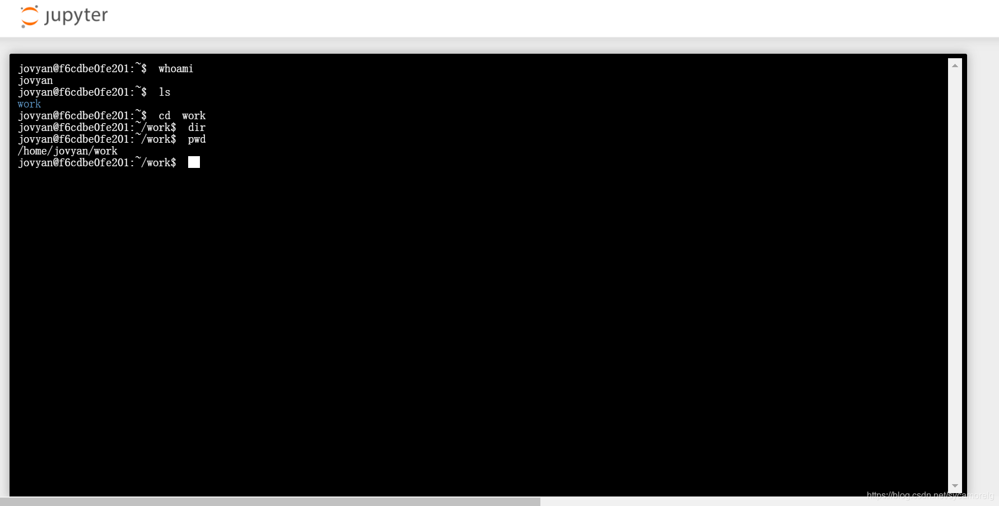

### 一 漏洞描述
Jupyter Notebook（此前被称为 IPython notebook）是一个交互式笔记本，支持运行 40 多种编程语言。

如果管理员未为Jupyter Notebook配置密码，将导致未授权访问漏洞，游客可在其中创建一个console并执行任意Python代码和命令。

### 二 漏洞利用

### 三 漏洞修复
添加验证

> 参考链接  
> https://blog.csdn.net/sycamorelg/article/details/118605337
