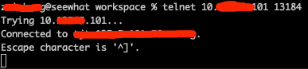
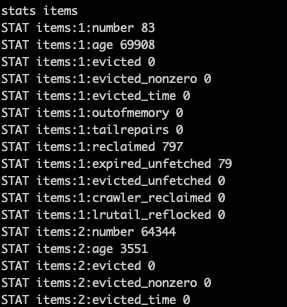
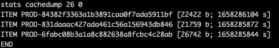

### 一 漏洞描述
Memcached 是一套常用的 key-value 缓存系统，由于它本身没有权限控制模块，所以对公网开放的 Memcache 服务很容易被攻击者扫描发现

危害：

1.攻击者通过命令交互可直接读取 Memcached 中的敏感信息。

2.攻击者 利用Memcached 协议的 UDP 端口开展攻击，攻击者通过向开启了 UDP 协议支持的 Memcached 服务器上发送伪造的 IP 欺骗请

求，Memcached 服务器会将大量的响应报文发往目标攻击主机，从而占用目标攻击机器的大量带宽资源，导致拒绝服务。

### 二 漏洞利用
连接: `telnet {ip} {port}`

列出所有key: `stats items`

通过itemid 获取key: `stats cachedump {id} 0`

获取数据: `get {key}`

### 三 漏洞修复
1 关闭
2 改用其他DB
3 限制访问白名单
4 命令 -l 限制本地访问

> 参考链接  
> http://t.zoukankan.com/xzlive-p-8893037.html  
> https://www.runoob.com/note/37360
