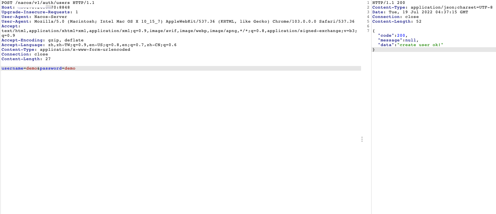

### 一 漏洞描述
Nacos（官方网站：http://nacos.io）是一个易于使用的平台，旨在用于动态服务发现，配置和服务管理。它可以帮助您轻松构建云本机应用程序和微服务平台。  
2020年12月29日，Nacos官方在github发布的issue中披露Alibaba Nacos 存在一个由于不当处理User-Agent导致的未授权访问漏洞 。通过该漏洞，攻击者可以进行任意操作，包括创建新用户并进行登录后操作。  
影响版本: Nacos < 1.4.1

当我们UA恶意改为Nacos-Server的时候，就会被误以为是服务间的通信，在白名单当中，绕过认证。

### 二 漏洞利用

回到 /nacos登录即可

### 三 漏洞修复
升级1.4.1，根据官方配置关闭user-agent通信白名单
```
### 开启鉴权
nacos.core.auth.enabled=true

### 关闭使用user-agent判断服务端请求并放行鉴权的功能
nacos.core.auth.enable.userAgentAuthWhite=false

### 配置自定义身份识别的key（不可为空）和value（不可为空）
nacos.core.auth.server.identity.key=example
nacos.core.auth.server.identity.value=example
```

> 参考链接  
> https://cloud.tencent.com/developer/article/1784279  
> https://www.cnblogs.com/Hi-blog/p/nacos-authentication-bypass.html
> github issue: https://github.com/alibaba/nacos/issues/4593  
> https://nacos.io/zh-cn/docs/auth.html
