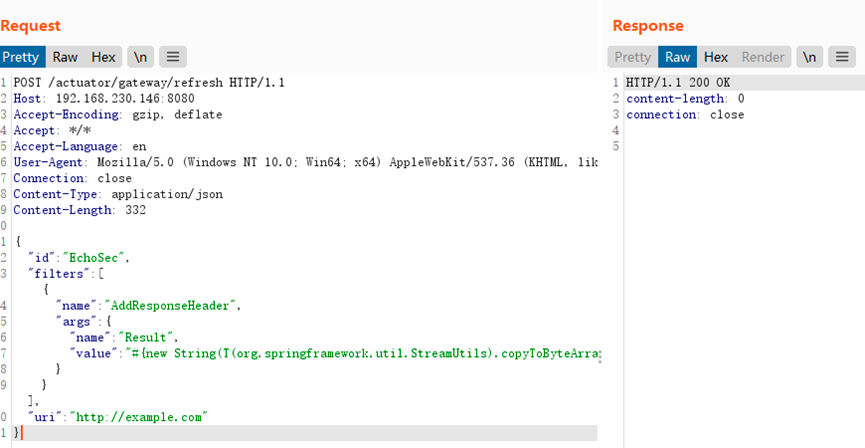
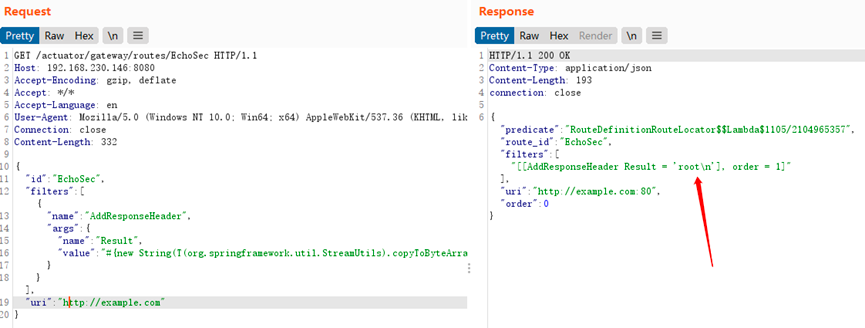

### 一 漏洞描述
当Spring Cloud Gateway启用和暴露 Gateway Actuator 端点时，使用 Spring Cloud Gateway 的应用程序可受到代码注入攻击。攻击者可以发送特制的恶意请求，从而远程执行任意代码。

### 二 漏洞利用
添加路由

刷新网关

访问路由触发命令执行

### 三 漏洞修复

Spring Cloud Gateway >= 3.1.1

Spring Cloud Gateway >= 3.0.7

> 参考链接
> https://blog.csdn.net/jd_cx/article/details/124723888
