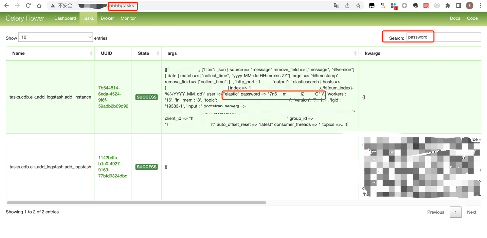

### 一 漏洞描述
celery flower未授权访问，task可以看到队列信息，其中有部分可能含有敏感信息如redis账密

### 二 漏洞利用

### 三 漏洞修复
1 关闭celery flower  
2 添加验证信息，可添加--basic_auth=user:password来限制  
https://flower.readthedocs.io/en/latest/auth.html#http-basic-authentication
