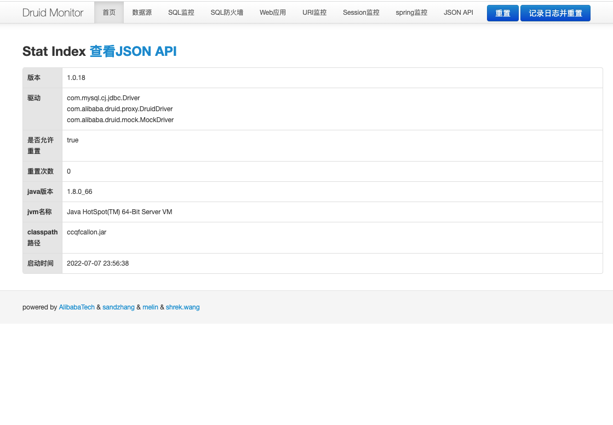

### 一 漏洞描述
druid是国内及公司内部最常用的数据库连接池配置管理工具；其内置监控页面，用于拦截sql及实时监控连接池/sql信息，该页面在原生的druid包中默认为禁用，但其用于适配springboot的druid-spring-boot-starter包，默认打开该监控页面(http://ip:port/druid/index.html)  
存在暴露DB信息: 由于druid监控页面地址是固定的，容易被猜，监控页面默认没有任何安全措施，容易暴露项目信息，如：数据库域名地址、库名、表名、查询的sql及url等，如果druid有漏洞，甚至可能被攻击

### 二 漏洞利用
判断: {"/druid/index.html": "DruidVersion", "/": "<title>Apache Druid</title>"}

### 三 漏洞修复
关闭监控页面及相关的stat、web-stat监控项
