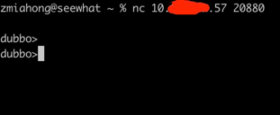

### 一 漏洞描述
Apache dubbo 未授权访问与弱口令

Dubbo是阿里巴巴公司开源的一个高性能优秀的 服务框架，使得应用可通过高性能的 RPC 实现服务的输 出和输入功能，可以和 Spring框架无缝集成。  
dubbo 因配置不当导致未授权访问漏洞。攻击者可利用此漏洞获取敏感信息，甚至控制服务器权限。

### 二 漏洞利用
方式1  

方式2  
直接插入invoke fastjson POC

### 三 漏洞修复
修改账户密码

> 参考链接
> https://blog.csdn.net/maverickpig/article/details/122724660
> http://maya66.net.cn/2020/07/03/dubbo%E6%9C%AA%E6%8E%88%E6%9D%83%E8%AE%BF%E9%97%AE%E6%9E%84%E9%80%A0fastjson%E8%8E%B7%E5%8F%96%E7%B3%BB%E7%BB%9Fshell/
