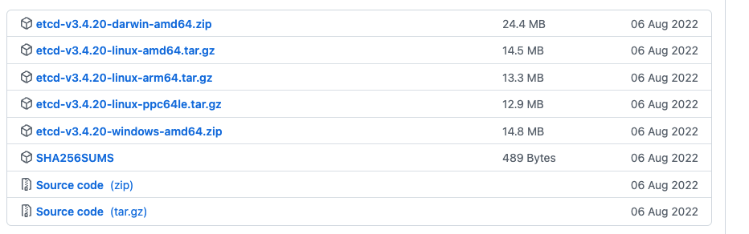
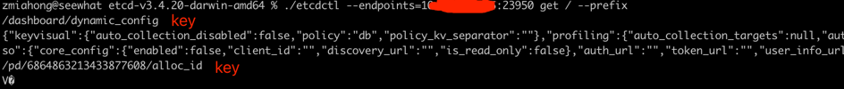
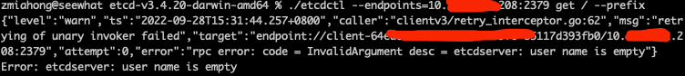

### 一 漏洞描述
etcd是一个具有强一致性的分布式 key-value 存储组件。采用类似目录结构的方式对数据进行存储，仅在叶子结点上存储数据，叶子结点的父节点为目录，不能存储数据。

“etcd”这个名字源自两个想法：unix “/etc” 目录和 “d” istributed 分布式系统。“/etc” 目录是用于存储单个系统的配置数据的位置，而 etcd 用于存储大规模分布式的配置信息。因此，加了 “d” 的 “/etc” 就是 “etcd”。  

未授权访问可获取存储数据。

### 二 漏洞利用
https://github.com/etcd-io/etcd/releases/  
mac下载第一个  
 
 
利用命令  
这种是使用etcdctl 3版本  
`./etcdctl --endpoints={IP}:{端口} get / --prefix`  

版本可以通过 `export ETCDCTL_API=3`  `export ETCDCTL_API=2` 切换

通过basic认证修复后链接效果，提示缺了user参数  

### 三 漏洞修复
参考 https://www.anquanke.com/post/id/236831  
BASCI认证 或 基于TLS的认证传输

> 参考链接  
> https://www.anquanke.com/post/id/236831
