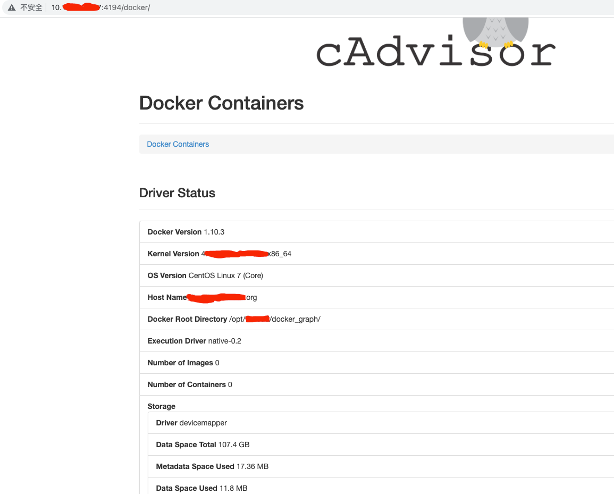
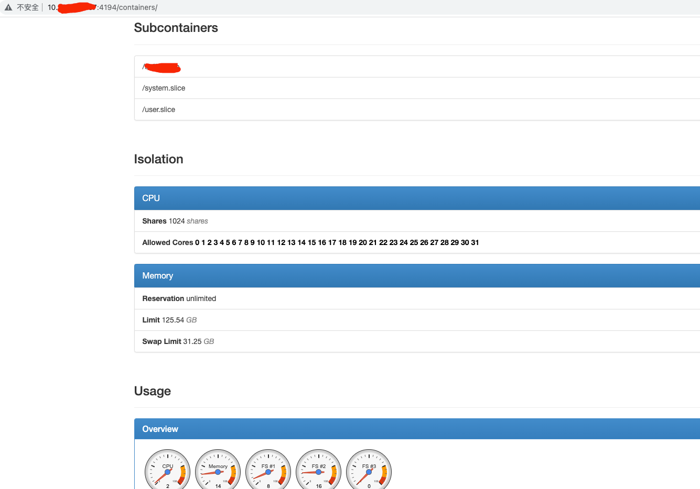

### 一 漏洞描述
cadvisor 4194端口：kublet 通过该端口可以获取到该节点的环境信息以及 node 上运行的容器状态等内容，访问 http://localhost:4194 可以看到 cAdvisor 的管理界面，通过 kubelet 的启动参数 --cadvisor-port 可以指定启动的端口。  

可能泄露docker敏感信息

### 二 漏洞利用
获取一些参数

获取CPU/内存/使用量等信息

### 三 漏洞修复
参考 https://docs.huihoo.com/apache/mesos/chrisrc.me/dcos-admin-monitoring-docker.html  
添加HTTP基本认证

> 参考链接  
> 漏洞描述: https://codeantenna.com/a/ec35umKWlb  
> 漏洞修复: https://docs.huihoo.com/apache/mesos/chrisrc.me/dcos-admin-monitoring-docker.html
