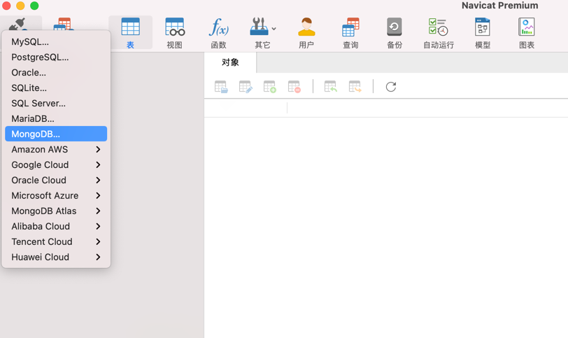

### 一 漏洞描述
Mongodb是一个nosql的数据库的一种数据库，他是介于关系型数据库与非关系型数据库之间的一种数据库，也可以理解为它是介于Redis与Mysql之间的一种数据库。  
最适合的场景为网站信息存储，如文章存储，直接返回Json格式，或日志存储。  
不适合有关系逻辑型的场景使用，如订单，产品，硬件数据，智慧矿山等。    
未授权与弱口令访问可直接操作数据。

### 二 漏洞利用
Robo 3T 或 navicat直连

### 三 漏洞修复
修改口令
