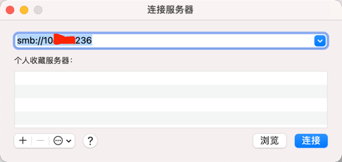

### 一 漏洞描述
Samba是一个实现不同操作系统（Windows、Linux、UNIX）之间文件共享和打印机共享的一种SMB协议的免费软件。SMB协议是客户机/服务器协议，客户机通过该协议可以访问服务器上的共享文件及打印机共享资源。   
它主要应用于局域网上，也可以通过设置“NetBIOS over TCP/IP”同互联网中的电脑分享资源。  
SMB协议：TCP 139端口 CIFS协议：TCP 445端口   

### 二 漏洞利用
samba匿名用户连接
mac: 访达 -> command+k

选择匿名用户连接

### 三 漏洞修复
1 关闭samba/匿名访问  
2 限制文件访问权限  

