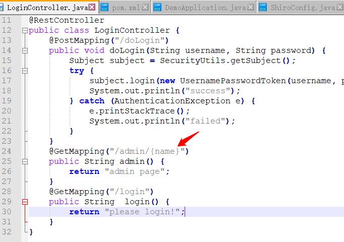
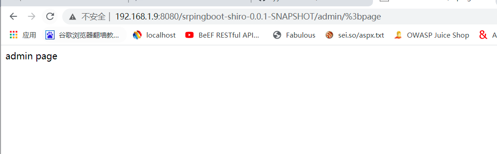

### 一 漏洞描述
Apache Shiro 身份验证绕过漏洞(CVE-2020-13933) 

Apache Shiro < 1.6.0

Apache Shiro是一个强大且易用的Java安全框架,执行身份验证、授权、密码和会话管理。一般作为spring鉴权模块。  
由于shiro在处理url时与spring仍然存在差异，依然存在身份校验绕过漏洞由于处理身份验证请求时出错，远程攻击者可以发送特制的HTTP请求，绕过身份验证过程并获得对应用程序的未授权访问。  

### 二 漏洞利用



```http://192.168.1.9:8080/srpingboot-shiro-0.0.1-SNAPSHOT/admin/%3bpage``` 构造poc请求指定资源，不触发身份验证，绕过权限访问接口

### 三 漏洞修复
更新 Apache Shiro >= 1.6.0

> 参考链接  https://www.cnblogs.com/backlion/p/14055278.html?ivk_sa=1024320u
