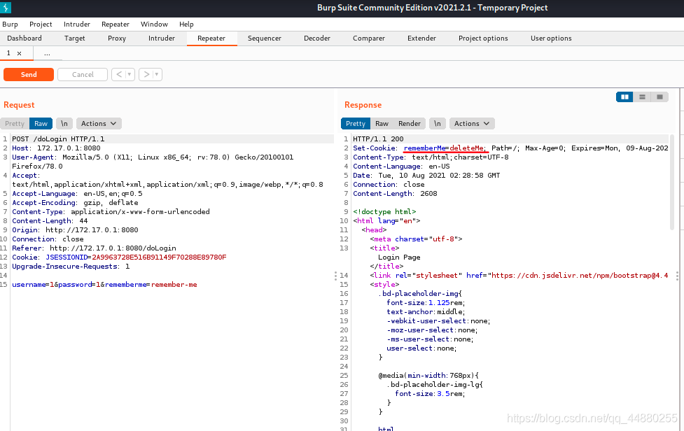

### 一 漏洞描述
Apache shiro RememberMe反序列化漏洞 CVE-2016-4437

影响范围：Apache Shiro <= 1.2.4

shiro(日语发音，前身JSecurity)是apache的一个开源框架,是一个权限管理的框架,实现 用户认证、用户授权。  
shiro不依赖于spring，shiro不仅可以实现 web应用的权限管理，还可以实现c/s系统，分布式系统权限管理，shiro属于轻量框架，越来越多企业项目开始使用shiro。
Apache Shiro 1.2.4及以前版本中，默认使用了CookieRememberMeManager，加密的用户信息序列化后存储在名为remember-me的Cookie中。  
得到rememberMe的cookie值；Base64解码；AES解密；反序列化。  
然而AES的密钥是硬编码的，即AES加解密的密钥是写死在代码中的，攻击者可以构造恶意数据造成反序列化漏洞。  

### 二 漏洞利用

根据key构造加密后的带有命令的cookie，发送请求时带上 cookie: rememberMe=xxx

### 三 漏洞修复
1.升级至1.2.4之后的版本

2.搜索如下代码片段

删除使用shiro时的securityManager.setRememberMeManager(rememberMeManager);  
或者修改key，确保key的唯一性

> 参考链接
> https://blog.csdn.net/qq_44880255/article/details/119568296
