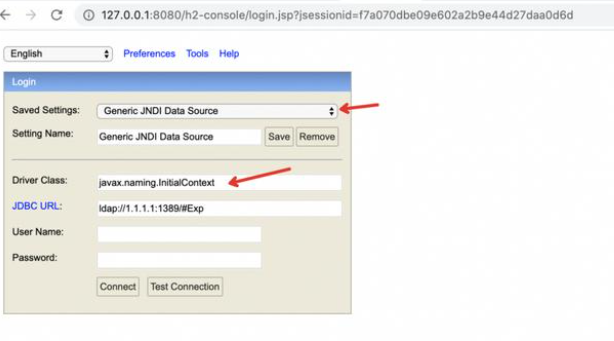

### 一 漏洞描述
H2是基于java的内存型的数据库,可以选择以内存模式或者文件形式存储,内存形式每次程序关闭数据库则销毁。  
拥有基于浏览器的控制台应用程序。

如果用户的Spring Boot项目中包含h2database库，并且在配置文件中启用了h2-console，可能受到漏洞影响，攻击者在不需要任何权限的情况下即可在受影响服务器上执行任意命令。

影响范围  
JDK < 6u201、7u191、8u182、11.0.1

### 二 漏洞利用

### 三 漏洞修复
在配置文件中去掉spring.h2.console.enabled=true；  
升级到较高版本的JDK；
> 参考链接
> http://www.h2database.com/html/main.html
> https://anquan.baidu.com/article/1078
