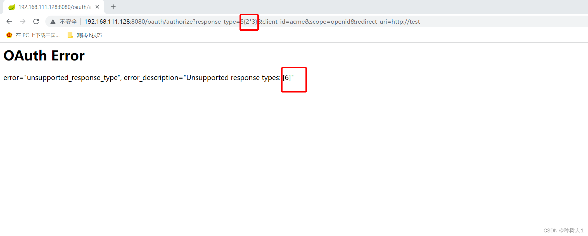

### 一 漏洞描述
Spring Security OAuth 是为 Spring 框架提供安全认证支持的一个模块。在其使用 whitelabel views 来处理错误时，由于使用了Springs Expression Language (SpEL)，攻击者在被授权的情况下可以通过构造恶意参数来远程执行命令

影响范围：  
2.0.0 to 2.0.9  
1.0.0 to 1.0.5

### 二 漏洞利用

### 三 漏洞修复
升级
