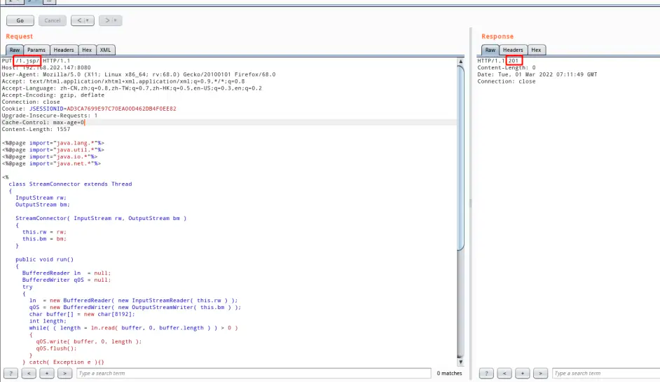

### 一 漏洞描述
在启用HTTP PUT的Windows服务器上运行Apache Tomcat 7.0.0 到 7.0.79 时，可以通过特制请求将 JSP 文件上传到服务器。  
然后可以请求这个JSP，并且它包含的任何代码都将由服务器执行。

### 二 漏洞利用


### 三 漏洞修复
1 升级

2 禁用PUT方法

在Tomcat的web.xml 文件中配置org.apache.catalina.servlets.DefaultServlet的初始化参数
```
<init-param>
<param-name>readonly</param-name>
<param-value>true</param-value>
</init-param>
```

> 参考链接
> https://www.bilibili.com/read/cv15472118/
> https://cve.mitre.org/cgi-bin/cvename.cgi?name=CVE-2017-12615
