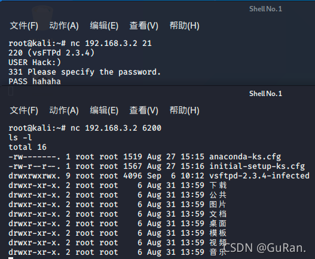

### 一 漏洞描述
vsftpd-v2.3.4 后门

vsftpd (very secure FTP daemon) 是一个类Unix系统以及Linux上的FTP服务器软件。  
它是Ubuntu、CentOS、Fedora、NimbleX、Slackware和Red Hat Enterprise Linux等Linux发行版的默认FTP服务器软件。  
它采用GNU通用公共许可证授权，并支持IPv6、TLS和FTPS。  
2011年7月，可从主站点下载的 vsftpd 版本 2.3.4 被发现已经被入侵。  
登录受感染的 vsftpd-2.3.4 服务器进行FTP认证时，如果用户名USER中包含:)，那么直接触发监听6200端口的正向shell

### 二 漏洞利用

> 参考链接: https://blog.csdn.net/m0_60883328/article/details/120244930

### 三 漏洞修复
更新到最新版本
