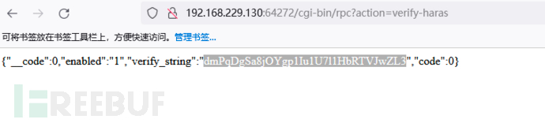
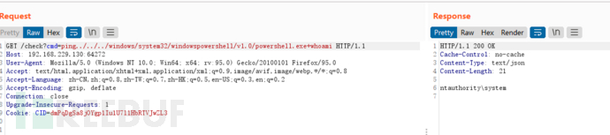

### 一 漏洞描述
向日葵是一款免费的，集远程控制电脑手机、远程桌面连接、远程开机、远程管理、支持内网穿透的一体化远程控制管理工具软件。上海贝锐信息科技股份有限公司向日葵个人版for Windows存在命令执行漏洞，攻击者可利用该漏洞获取服务器控制权。。  

向⽇葵个⼈版企业版均受影响 for Windows <=11.0.0.33

### 二 漏洞利用
SunloginClient 启动后会在 40000 以上随机开放⼀个web端⼝，认证有问题可以直接通过cgi-bin/rpc?action=verify-haras获取cid 执
⾏回显rce

### 三 漏洞修复
升级至最新版本

> 参考链接：
> http://cicm.njts.edu.cn/2022/0416/c5103a64093/page.psp
> https://www.freebuf.com/news/322163.html
